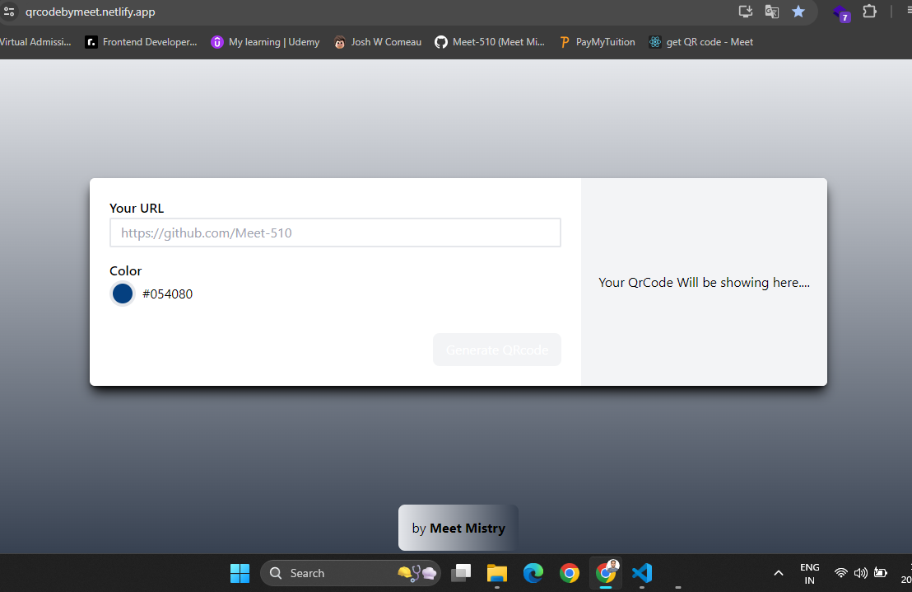
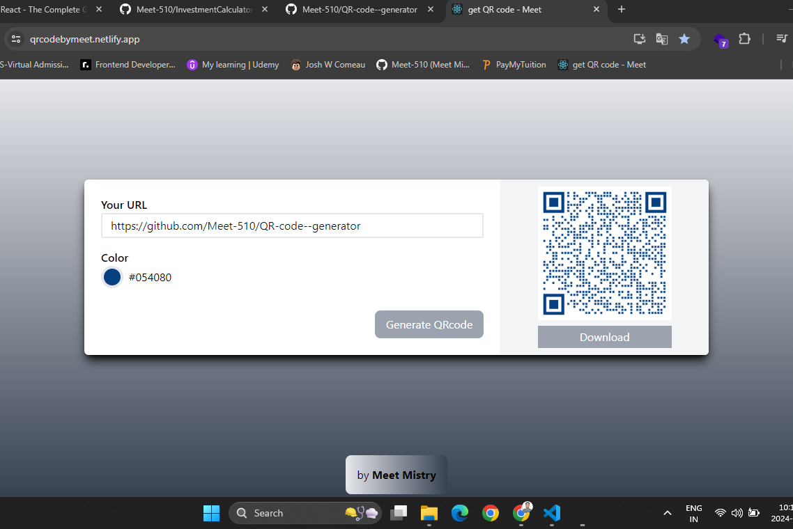

## React QR Code Generator App

This is a simple React application designed for practicing React concepts, specifically focused on creating a QR code generator for links. The app allows users to input a URL and generates a corresponding QR code that can be scanned to open the provided link.

### Features

- **Input URL**: Users can enter any valid URL into the input field.
- **Generate QR Code**: Upon submitting the URL, the app generates a QR code representing the input link.
- **Download QR Code**: Users can download the generated QR code image for offline use.

### Technologies Used

- React
- react-router-dom (for routing)
- Tailwind CSS

Live demo : https://qrcodebymeet.netlify.app/

